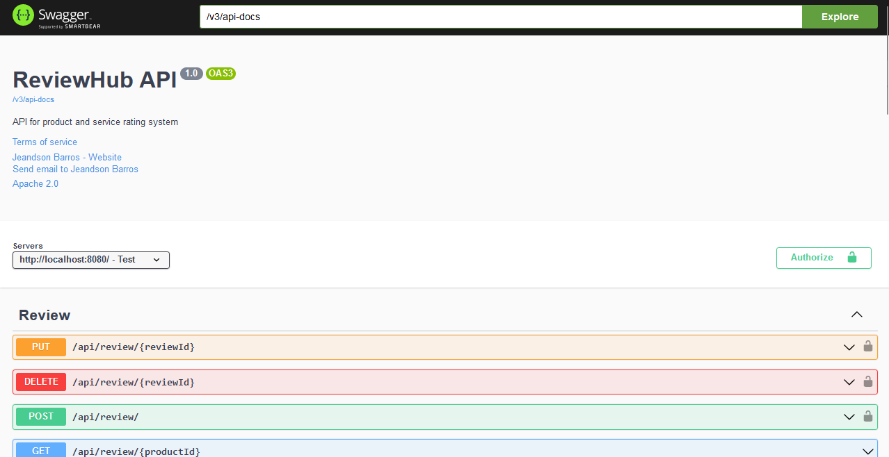
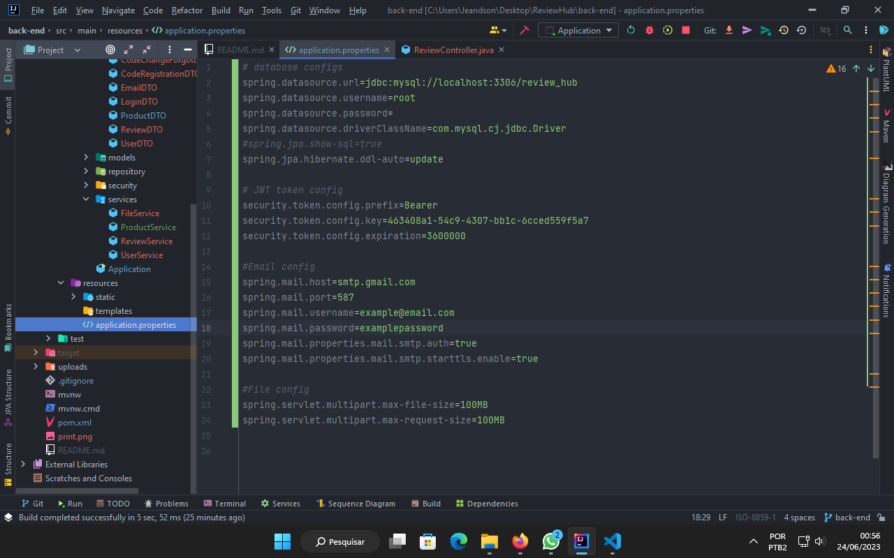

# API(back-end) Review Hub by Spring Boot

API developed for product reviews system, the adm to register products and another user give their opinions about the products.

To get detailed information about the API, run the API and open the following link in your browser: http://localhost:8080/swagger-ui/index.html

## Getting Started

### Execution

To run the project, you need to pass the following information in application.properties:

- Database configs: 
`spring.datasource.url=jdbc:mysql://localhost:3306/review_hub` 
`spring.datasource.username=root` 
`spring.datasource.password=` 
`spring.datasource.driverClassName=com.mysql.cj.jdbc.Driver` 
`spring.jpa.hibernate.ddl-auto=update` 
---
- Email config: 
`spring.mail.host=smtp.gmail.com` 
`spring.mail.port=587` 
`spring.mail.username=example@email.com` 
`spring.mail.password=examplepassword` 
`spring.mail.properties.mail.smtp.auth=true` 
`spring.mail.properties.mail.smtp.starttls.enable=true` 

## Functionalities

### Auth
<table>
<thead>
     <th title="Requirements Specification">Req #</th>
     <th>Action</th>
     <th>Description</th>
     <th>Access point</th>
     <th>Http method</th>
     <th>Authorization</th>
</thead>
<tbody>
    <tr>
        <td>01</td>
        <td>Log in</td>
        <td>The user informs the email and password, if the credentials are correct the system returns a JWT token, if the credentials are incorrect or missing, the system returns a message describing the error.</td>
        <td>/api/auth/login</td>
        <td>POST</td>
        <td>Permit All</td>
    </tr>
    <tr>
        <td>02</td>
        <td>User register</td>
        <td>The user informs the name, email and password, if the data entered are correct, the registration is made and an email with a code for the activation of the account is sent to the informed email. If data is missing, the system returns a message informing the error.
Note: Requirement 03 is required to activate the account.</td>
        <td>/api/auth/register</td>
        <td>POST</td>
        <td>Permit All</td>
    </tr>
    <tr>
        <td>03</td>
        <td>Complete registration</td>
        <td>The user informs the email and the code that was sent to the email to confirm the registration.</td>
        <td>/api/auth/complete-registration</td>
        <td>PUT</td>
        <td>Permit All</td>
    </tr>
    <tr>
        <td>04</td>
        <td>Get account details</td>
        <td>The authenticated user requests his own account data and a JSON containing his data (except the password for security reasons) is returned.</td>
        <td>/api/auth/account-data</td>
        <td>GET</td>
        <td>Authenticated</td>
    </tr>
<tr>
        <td>05</td>
        <td>Fully upgrade the account</td>
        <td>The user informs all his new data to be updated. As it is a request PUT, all fields must be informed, if there is an error, the system returns a message describing the error.</td>
        <td>/api/auth/update</td>
        <td>PUT</td>
        <td>Authenticated</td>
    </tr>
<tr>
        <td>06</td>
        <td>Partially upgrade own account</td>
        <td>O usuário informa seus novos dados para que sejam atulizado. Como é uma requisão PATCH não é preciso informar todos os  campos, caso aja algum erro o sistema retorna  uma mensagem descrevendo o erro.</td>
        <td>/api/auth/update</td>
        <td>PATCH</td>
        <td>Authenticated</td>
    </tr>
<tr>
        <td>07</td>
        <td>Delete to own account</td>
        <td>The authenticated user deletes his own account and all data related to it such as the revews that the user made.</td>
        <td>/api/auth/account-delete</td>
        <td>DELETE</td>
        <td>Authenticated</td>
    </tr>
<tr>
        <td>08</td>
        <td>Get a user's picture</td>
        <td>The filename is given via path, and an image file is returned. If the file does not exit, a message informs the error with status 404.</td>
        <td>/api/auth/get-img/{fileName}</td>
        <td>GET</td>
        <td>Permit All</td>
    </tr>
<tr>
        <td>09</td>
        <td>Send email code to change forgotten password</td>
        <td>If the user has forgotten the password, he must inform the email, so that a code valid for 15 minutes is sent and he can use it to reset the elusive password.</td>
        <td>/api/auth/forgotten-password/send-email</td>
        <td>POST</td>
        <td>Permit All</td>
    </tr>
<tr>
        <td>10</td>
        <td>Change forgotten password</td>
        <td>Change the forgotten password using the code that was sent to the email, for this request to be made, the user must inform the email, the code that was sent to the email and the new password.</td>
        <td>/forgotten-password/change-password</td>
        <td>PUT</td>
        <td>Permit All</td>
    </tr>
<tr>
        <td>11</td>
        <td>Get list users</td>
        <td>A list of system users is returned, only admin and master have authorization to request this list.</td>
        <td>/api/auth/list-users</td>
        <td>GET</td>
        <td>ADMIN, MASTER</td>
    </tr>
<tr>
        <td>12</td>
        <td>Fully upgrade a user</td>
        <td>An ADMIN or a MASTER fully updates another user's account. The ADMIN account can update a USER account and the MASTER account can update an ADMIN account or a USER account. The user's email that will be updated must be informed in the middle of the path, if something goes wrong the system returns a message describing the error.</td>
        <td>/api/auth/update-a-user/{email}</td>
        <td>PUT</td>
        <td>ADMIN, MASTER</td>
    </tr>
<tr>
        <td>13</td>
        <td>Partially update a user</td>
        <td>An ADMIN or a MASTER partially updates another user's account. The ADMIN account can update a USER account and the MASTER account can update an ADMIN account or a USER account. The user's email that will be updated must be informed in the middle of the path, if something goes wrong the system returns a message describing the error.</td>
        <td>/api/auth/update-a-user/{email}</td>
        <td>PATCH</td>
        <td>ADMIN, MASTER</td>
    </tr>
<tr>
        <td>14</td>
        <td>An admin or a master can delete another person's account </td>
        <td>The ADMIN account can delete a USER account, and the MASTER account can delete an ADMIN account or a USER account, the email of the account that will be deleted must be informed in the path, if there is any error the API will return an informed message or error .</td>
        <td>/api/auth/delete-a-user/{email}</td>
        <td>DELETE</td>
        <td>MASTER</td>
    </tr>

</tbody>
</table>

### Product

<table>
<thead>
 <th title="Requirements Specification">Req #</th>
     <th>Action</th>
     <th>Description</th>
     <th>Access point</th>
     <th>Http method</th>
     <th>Authorization</th>
</thead>
<tbody>
<tr>
        <td>15</td>
        <td>Get products</td>
        <td>A list of products is returned by the system</td>
        <td>/api/product/</td>
        <td>GET</td>
        <td>Permit All</td>
    </tr>
<tr>
        <td>16</td>
        <td>Get product</td>
        <td>Data of a specific product is returned, for this it is necessary to inform the id of the product through the path, if the product does not exist a message saying "product not found" will be returned with the status 404.</td>
        <td>/api/product/{id}</td>
        <td>GET</td>
        <td>Permit All</td>
    </tr>
<tr>
        <td>17</td>
        <td>Get a product image</td>
        <td>The filename is given via path, and an image file is returned. If the file does not exit, a message informs the error with status 404.</td>
        <td>/api/product/get-img/{fileName}</td>
        <td>GET</td>
        <td>Permit All</td>
    </tr>
<tr>
        <td>18</td>
        <td>Partially update product</td>
        <td>The action product data is partially updated, that is, it is not necessary to inform all fields, product id must be informed by path. If something is wrong in the request, the api will return a message describing the error.</td>
        <td>/api/product/{id}</td>
        <td>PATCH</td>
        <td>ADMIN, MASTER</td>
    </tr>
<tr>
        <td>19</td>
        <td>Fully update product</td>
        <td>The action product data is fully updated, that is, all data needs to be informed, product id must be informed by the path. If something is wrong in the request, the api will return a message describing the error.</td>
        <td>/api/product/{id}</td>
        <td>PUT</td>
        <td>ADMIN, MASTER</td>
    </tr>
<tr>
        <td>19</td>
        <td>Delete a product</td>
        <td>The product and its reviews are deleted, the product id must be informed along the way. If something is wrong in the request, the api will return a message describing the error.</td>
        <td>/api/product/{id}</td>
        <td>DELETE</td>
        <td>ADMIN, MASTER</td>
    </tr>
</tbody>
</table>

### Review
<table>
<thead>
 <th title="Requirements Specification">Req #</th>
     <th>Action</th>
     <th>Description</th>
     <th>Access point</th>
     <th>Http method</th>
     <th>Authorization</th>
</thead>
<tbody>
<tr>
        <td>20</td>
        <td>Get reviews</td>
        <td>The product and its reviews are deleted, the product id must be informed along the way. If something is wrong in the request, the api will return a message describing the error.</td>
        <td>/api/review/{productId}</td>
        <td>GET</td>
        <td>Permit All</td>
    </tr>
<tr>
        <td>21</td>
        <td>Get user Reviews</td>
        <td>Returns a list of reviews made by the authenticated user.</td>
        <td>/api/review/user-reviews</td>
        <td>GET</td>
        <td>Authenticated</td>
    </tr>
<tr>
        <td>22</td>
        <td>Get user a review by product</td>
        <td>Obtaining a review made by the user through the product id, if the product does not exist or the user has not yet reviewed the product, the 404 error will be returned. The product id must be informed in the path.</td>
        <td>/api/review/user-review-by-product/{productId}</td>
        <td>GET</td>
        <td>Authenticated</td>
    </tr>
<tr>
        <td>23</td>
        <td>Get reviews</td>
        <td>The product and its reviews are deleted, the product id must be informed along the way. If something is wrong in the request, the api will return a message describing the error.</td>
        <td>/api/review/user-review-by-product/{productId}</td>
        <td>GET</td>
        <td>Permit All</td>
    </tr>
<tr>
        <td>24</td>
        <td>Create a review</td>
        <td>The user registering a review of a product, in the body of the request must have the product id and a note that can be from 1 to 5, a comment is not mandatory, but, if the comment is informed, it must have a maximum of 570 characters. If something is wrong, the api will return a message describing the error.</td>
        <td>/api/review/</td>
        <td>POST</td>
        <td>Authenticated</td>
    </tr>
<tr>
        <td>25</td>
        <td>Update a review</td>
        <td>The user updates a review already made of a product, the body of the request must have the product id and a score that can be from 1 to 5, a comment is not mandatory, but if the comment is informed, it must have a maximum of 570 characters, the review id must be informed in the path. If something is wrong, the api will return a message describing the error.</td>
        <td>/api/review/</td>
        <td>PUT</td>
        <td>Authenticated</td>
    </tr>
<tr>
        <td>26</td>
        <td>Delete a reviews</td>
        <td>The user deletes a review he made of a product, the id of the review must be informed in the path. If something is wrong, the api will return a message describing the error.</td>
        <td>/api/review/{productId}</td>
        <td>DELETE</td>
        <td>Authenticated</td>
    </tr>
</tbody>
</table>

### Reference Documentation

For further reference, please consider the following sections:

* [Official Apache Maven documentation](https://maven.apache.org/guides/index.html)
* [Spring Boot Maven Plugin Reference Guide](https://docs.spring.io/spring-boot/docs/3.0.6/maven-plugin/reference/html/)
* [Create an OCI image](https://docs.spring.io/spring-boot/docs/3.0.6/maven-plugin/reference/html/#build-image)
* [Spring Web](https://docs.spring.io/spring-boot/docs/3.0.6/reference/htmlsingle/#web)
* [Spring Boot DevTools](https://docs.spring.io/spring-boot/docs/3.0.6/reference/htmlsingle/#using.devtools)
* [Spring Data JPA](https://docs.spring.io/spring-boot/docs/3.0.6/reference/htmlsingle/#data.sql.jpa-and-spring-data)

### Guides

The following guides illustrate how to use some features concretely:

* [Building a RESTful Web Service](https://spring.io/guides/gs/rest-service/)
* [Serving Web Content with Spring MVC](https://spring.io/guides/gs/serving-web-content/)
* [Building REST services with Spring](https://spring.io/guides/tutorials/rest/)
* [Accessing Data with JPA](https://spring.io/guides/gs/accessing-data-jpa/)
* [Accessing data with MySQL](https://spring.io/guides/gs/accessing-data-mysql/)
